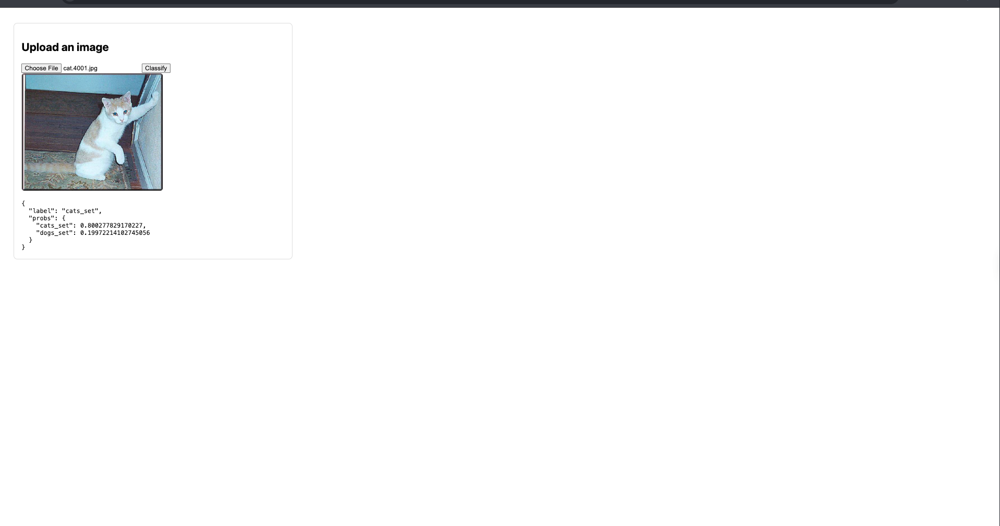

# Animals Detection MLOps

A production-grade Cats vs Dogs classifier with an end-to-end MLOps pipeline (data ingestion → base model → training → evaluation) and a FastAPI inference API/UI. CI/CD ships a Docker image to AWS ECR.

[](pyproject.toml) [](app.py) [](https://pytorch.org/) [](dvc.yaml) [](Dockerfile) [](.github/workflows/main.yaml)

---

## Table of Contents

- [Features](#features)
- [Demo](#demo)
- [Architecture](#architecture)
- [Quickstart](#quickstart)
- [Usage](#usage)
- [API Reference](#api-reference)
- [Evaluation & Artifacts](#evaluation--artifacts)
- [Troubleshooting](#troubleshooting)
- [Configuration](#configuration)
- [Project Structure](#project-structure)
- [Docker](#docker)
- [CI/CD](#cicd-github-actions--aws-ecr)
- [Experiment Tracking](#experiment-tracking)
- [Roadmap & Contribution](#roadmap--contribution)

---

## Features

- End-to-end reproducible pipeline managed by DVC and Python scripts
- Transfer learning base model with configurable hyperparameters
- Robust evaluation (accuracy, per-class metrics, classification report, confusion matrix)
- FastAPI server with web upload UI and OOD handling (unknown below confidence threshold)
- Model hot-reload without server restart
- Containerized deployment and CI/CD to AWS ECR

---

## Demo

Preview images available in the repository root:

| Cat demo | Dog demo |
| --- | --- |
|  |  |

---

## Architecture


---

## Quickstart

1. **Clone & Install Dependencies**
   ```bash
   # Create environment (optional but recommended)
   conda create -n animals python=3.11 -y
   conda activate animals
   
   # Install requirements
   pip install -r requirements.txt
   ```

2. **Run MLOps Pipeline**
   Execute the full ingestion, training, and evaluation pipeline:
   ```bash
   python main.py
   ```

3. **Launch API / UI**
   Start the FastAPI server locally:
   ```bash
   uvicorn app:app --host 0.0.0.0 --port 8000
   ```
   > Open [http://localhost:8000](http://localhost:8000) to access the web interface.

---

## Usage

### Training
To retrain the model from scratch using the DVC-controlled pipeline:
```bash
python main.py
```

### Inference Server
Start the server for predictions:
```bash
uvicorn app:app --host 0.0.0.0 --port 8000
```

- **Health Check**: `GET /health`
- **Reload Model**: `GET /reload` (updates weights without restarting container)

### Command Line Prediction
Example using `curl`:

```bash
curl -X POST "http://localhost:8000/predict" -F "file=@cat.10.jpg"
```

**Response:**
```json
{
  "label": "cats_set",
  "probs": { 
    "cats_set": 0.56, 
    "dogs_set": 0.44 
  }
}
```
> Note: If confidence is below 75%, the API returns `"label": "unknown"`.

---

## API Reference

- POST /predict — multipart/form-data (field: file)
- GET /reload — reloads trained weights
- GET /health — service liveness

---

## Evaluation & Artifacts

The model is evaluated using classification metrics to ensure reliability:

- Overall Accuracy — percentage of correct predictions across the validation set
- Per-class Accuracy — separate accuracy per class (cats_set, dogs_set)
- Classification Report — precision, recall, F1-score (sklearn.metrics.classification_report)
- Confusion Matrix — detailed error analysis (sklearn.metrics.confusion_matrix)

Artifacts:

- Trained weights: artifacts/training/model.pth
- Base models: artifacts/prepare_base_model/
- Logs: logs/running_logs.log
- TensorBoard: artifacts/prepare_callbacks/tensorboard_log_dir
- Checkpoints: artifacts/prepare_callbacks/checkpoint_dir

---

## Troubleshooting

If predictions look constant across different images:

- Ensure trained weights are loaded
  - Confirm artifacts/training/model.pth exists after training
  - Restart the server or call GET /reload after retraining
- Match preprocessing between training and inference (224×224, ImageNet mean/std)
- Train longer and/or unfreeze more layers
  - Increase EPOCHS in params.yaml and retrain
  - Consider unfreezing more of the classifier
- Check data balance and quality across classes
- For non-cat/dog inputs, expect "unknown" when confidence < 0.75

---

## Configuration

- Core paths: config/config.yaml
- Hyperparameters: params.yaml (EPOCHS, learning rate, image size, etc.)
- Data source: config/config.yaml (data_ingestion.source_URL)

Extracted dataset folders under artifacts/data_ingestion should contain one subfolder per class (e.g., cats_set, dogs_set).

---

## Project Structure

- app.py — FastAPI inference server (web UI + /predict)
- main.py — orchestrates MLOps pipeline stages
- config/config.yaml — paths for artifacts and outputs
- params.yaml — model/training hyperparameters
- artifacts/ — data, models, logs, checkpoints
- templates/index.html — simple upload UI
- dvc.yaml, dvc.lock — pipeline stages and locks
- Dockerfile — container image
- .github/workflows/main.yaml — CI/CD pipeline

---

## Docker

- Build locally: docker build -t animals-detection-mlops .
- Run locally: docker run -p 8000:8000 animals-detection-mlops

---

## CI/CD (GitHub Actions → AWS ECR)

- On push to main, the workflow builds and pushes a Docker image to ECR
- Required repository secrets: AWS_ACCESS_KEY_ID, AWS_SECRET_ACCESS_KEY, AWS_REGION, ECR_REPOSITORY_NAME

---

## Experiment Tracking

- TensorBoard: artifacts/prepare_callbacks/tensorboard_log_dir
- Checkpoints: artifacts/prepare_callbacks/checkpoint_dir

---

## Roadmap & Contribution

Planned improvements:

- Add more classes and data augmentation
- Export model in ONNX format for broader deployment
- Add Prometheus metrics and Grafana dashboard

Contribution:

- Fork the repo, create a feature branch, open a PR
